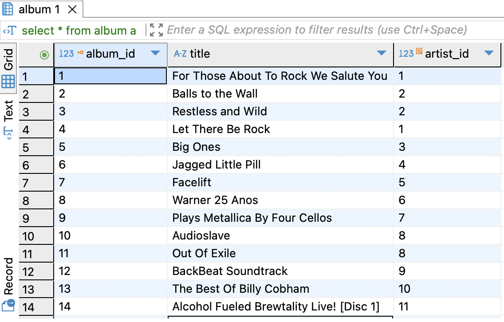
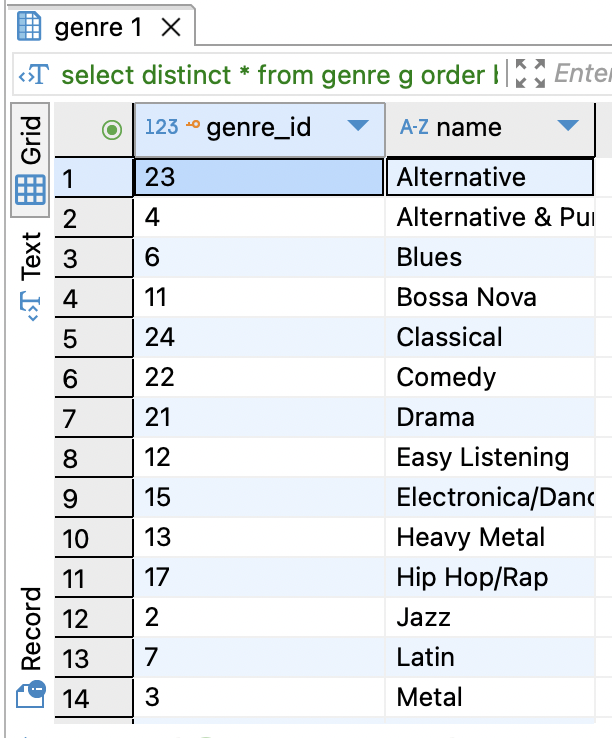
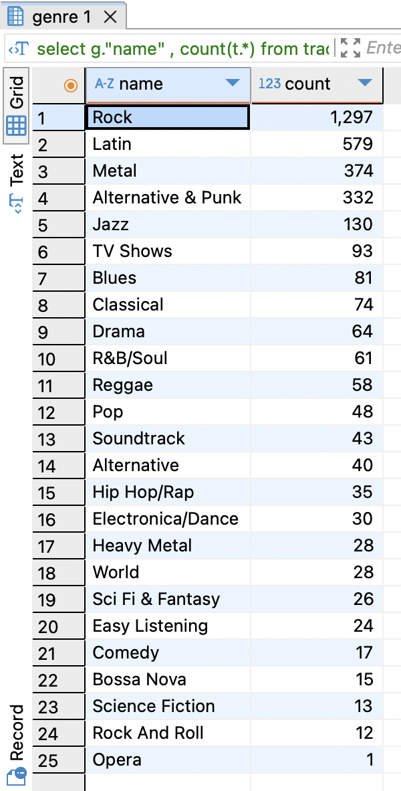

# Trabajo Práctico Nº 1
Referido a SQL.
s
# Base de datos 
Los ejercicios se hicieron a partir de la siguiente base de datos de ejemplo: \
Chinook Database - Version 1.4  \
Script: Chinook_PostgreSql.sql \
Description: Creates and populates the Chinook database. \
DB Server: PostgreSql \
Author: Luis Rocha \
License: http://www.codeplex.com/ChinookDatabase/license 

# Resolución
Se puede ver el listado completo de queries listas para ser ejecutado en un motor de base de datos postgres [aquí](chinook.sql)

## Detalle de cada una
A contuniación se visualizará una copia de cada query junto con un printscreen con el resultado obtenido. Se utilizó DBeaver para ejecutar las mismas.

```sql
-- Selecciona todos los registros de la tabla Albums.
select * from album a;
```


```sql
-- Selecciona todos los géneros únicos de la tabla Genres.
select distinct * from genre g order by g."name";
```


```sql
-- Cuenta el número de pistas por género.
select g."name" , count(t.*) from track t 
inner join genre g  on g.genre_id = t.genre_id
group by g."name"
order by count(t.*) desc;
```
