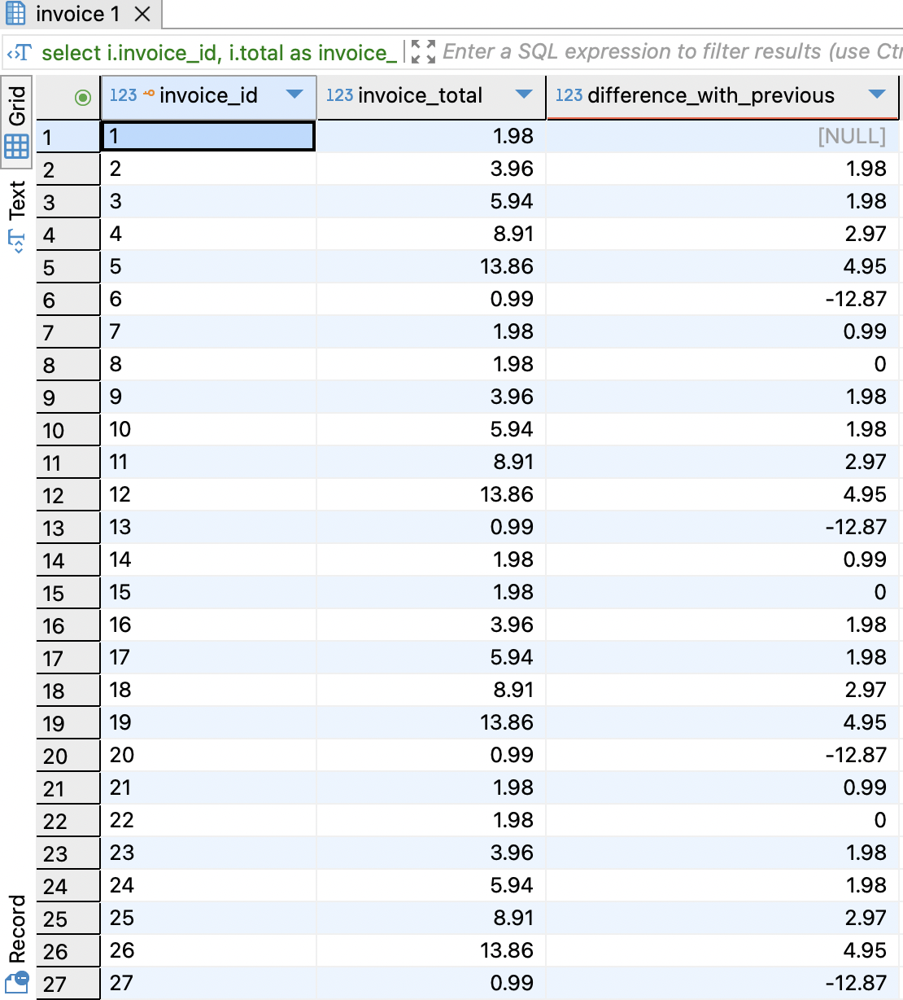

# Trabajo Práctico Nº 1
Referido a SQL.
s
# Base de datos 
Los ejercicios se hicieron a partir de la siguiente base de datos de ejemplo: \
Chinook Database - Version 1.4  \
Script: Chinook_PostgreSql.sql \
Description: Creates and populates the Chinook database. \
DB Server: PostgreSql \
Author: Luis Rocha \
License: http://www.codeplex.com/ChinookDatabase/license 

# Resolución
Se puede ver el listado completo de queries listas para ser ejecutado en un motor de base de datos postgres [aquí](chinook.sql)

## Detalle de cada una
A contuniación se visualizará una copia de cada query junto con un printscreen con el resultado obtenido. Se utilizó DBeaver para ejecutar las mismas.

```sql
-- Selecciona todos los registros de la tabla Albums.
select * from album a;
```


```sql
-- Selecciona todos los géneros únicos de la tabla Genres.
select distinct * from genre g order by g."name";
```


```sql
-- Cuenta el número de pistas por género.
select g."name" , count(t.*) from track t 
inner join genre g  on g.genre_id = t.genre_id
group by g."name"
order by count(t.*) desc;
```


```sql
-- Encuentra la longitud total (en milisegundos) de todas las pistas para cada álbum.
select a.title, sum(t.milliseconds)
from album a 
left join track t on a.album_id = t.album_id
group by a.title
order by sum(t.milliseconds) desc;
```


```sql
-- Lista los 10 álbumes con más pistas.
select a.title , count(t.*)
from album a 
inner join track t on a.album_id = t.album_id
group by a.title
order by count(t.*) desc
limit 10;
```


```sql
-- Encuentra la longitud promedio de la pista para cada género.
select g."name", avg(t.milliseconds)
from album a 
inner join track t on a.album_id = a.album_id
inner join genre g on g.genre_id = t.genre_id
group by
 g."name"
order by avg(t.milliseconds);
```


```sql
-- Para cada cliente, encuentra la cantidad total que han gastado.
select c.last_name, c.first_name, sum(i.total) total_gastado
from invoice i
inner join customer c on i.customer_id = c.customer_id
group by c.last_name, c.first_name
order by total_gastado desc;
```


```sql
-- Para cada país, encuentra la cantidad total gastada por los clientes.
select
i.billing_country, sum(total) total_x_pais
from invoice i 
group by i.billing_country
order by total_x_pais desc;
```


```sql
-- Clasifica a los clientes en cada país por la cantidad total que han gastado.
select
c.last_name , c.first_name, i.billing_country, sum(total) total_x_pais
,case when sum(total) > 40 then 'Gasto Mucho' else 'Gasto Poco' end as cuanto_gasto
, percent_rank() over (partition by i.billing_country order by sum(total) desc)
from invoice i 
inner join customer c on i.customer_id = c.customer_id
group by c.last_name , c.first_name, i.billing_country
order by i.billing_country  desc;
```


```sql
-- Para cada artista, encuentra el álbum con más pistas y clasifica a los artistas por este número.
select
sub.name, sub.title
from
(
select  a."name", a2.title , count(t.*) as q_pistas, 
rank() over(partition by a.name order by count(t.*) desc) as rank_title
from artist a 
inner join album a2 on a.artist_id = a2.artist_id
inner join track t  on t.album_id = a2.album_id
group by a."name", a2.title
order by a."name" , q_pistas desc
) sub 
where
rank_title = 1;
```


```sql
-- Selecciona todas las pistas que tienen la palabra "love" en su título.
-- Aquí lo interpreté como la palabra love en si misma, porque sino glove estaría incluida y no corresponde. Por eso devuelve
-- vacío
SELECT *
FROM Track
WHERE Name LIKE '% love %' -- "love" rodeado de espacios
   OR Name LIKE 'love %'   -- "love" al inicio
   OR Name LIKE '% love'   -- "love" al final
   OR Name = 'love';       -- "love" como título exacto
```


```sql
-- Selecciona a todos los clientes cuyo primer nombre comienza con 'A'.
select c.first_name, c.last_name from  
customer c
where c.first_name like 'A%'
order by c.first_name, c.last_name;
```


```sql
-- Calcula el porcentaje del total de la factura que representa cada factura.
with total_facturas as (
    select sum(i.total) as total_general
    from invoice i
)
select 
    i.invoice_id,
    i.total as invoice_total,
    round((i.total / tf.total_general) * 100, 2) as percentage_of_total
from 
    invoice i, total_facturas tf -- Probé en este caso el producto cartesiano tradicional para mostrar otras opciones
order by 
    percentage_of_total desc;
```


```sql
-- Calcula el porcentaje de pistas que representa cada género.
with total_pistas as (
    select count(t.track_id) as total_tracks
    from track t
)
select 
    g.name as genre_name,
    count(t.track_id) as tracks_per_genre,
    round((count(t.track_id) * 100.0) / tp.total_tracks, 2) as percentage_of_tracks
from 
    track t
inner join 
    genre g on t.genre_id = g.genre_id
cross join 
    total_pistas tp
group by 
    g.name, tp.total_tracks
order by 
    percentage_of_tracks desc;

```


```sql
-- Para cada cliente, compara su gasto total con el del cliente que gastó más.
with total_gastos as (
    select 
        c.customer_id,
        sum(i.total) as total_spent
    from 
        customer c
    inner join 
        invoice i on c.customer_id = i.customer_id
    group by 
        c.customer_id
),
max_gasto as (
    select max(tg.total_spent) as max_spent
    from total_gastos tg
)
select 
    tg.customer_id,
    tg.total_spent,
    mg.max_spent,
    mg.max_spent - tg.total_spent as difference_with_max
from 
    total_gastos tg
cross join 
    max_gasto mg
order by 
    difference_with_max desc;
```


```sql
-- Para cada factura, calcula la diferencia en el gasto total entre ella y la factura anterior.
select 
    i.invoice_id,
    i.total as invoice_total,
    i.total - lag(i.total) over (order by i.invoice_date) as difference_with_previous
from 
    invoice i
order by 
    i.invoice_date;
```


```sql
-- Para cada factura, calcula la diferencia en el gasto total entre ella y la próxima factura.
select 
    i.invoice_id,
    i.total as invoice_total,
    lead(i.total) over (order by i.invoice_date) - i.total as difference_with_next
from 
    invoice i
order by 
    i.invoice_date;
```


```sql
-- Encuentra al artista con el mayor número de pistas para cada género.
WITH track_counts AS (
    SELECT 
        g.name AS genre_name,
        ar.name AS artist_name,
        COUNT(t.track_id) AS track_count
    FROM 
        track t
    JOIN album al ON t.album_id = al.album_id
    JOIN artist ar ON al.artist_id = ar.artist_id
    JOIN genre g ON t.genre_id = g.genre_id
    GROUP BY 
        g.name, ar.name
)
SELECT 
    genre_name,
    artist_name,
    track_count
FROM 
    (
        SELECT 
            genre_name,
            artist_name,
            track_count,
            ROW_NUMBER() OVER (PARTITION BY genre_name ORDER BY track_count DESC) AS rank
        FROM 
            track_counts
    ) ranked
WHERE 
    rank = 1;
```


```sql
-- Compara el total de la última factura de cada cliente con el total de su factura anterior.
select 
    i.customer_id,
    i.invoice_id as current_invoice,
    i.total as current_total,
    lead(i.invoice_id) over (partition by i.customer_id order by i.invoice_date desc) as previous_invoice,
    lead(i.total) over (partition by i.customer_id order by i.invoice_date desc) as previous_total,
    i.total - lead(i.total) over (partition by i.customer_id order by i.invoice_date desc) as difference_with_previous
from 
    invoice i
order by 
    i.customer_id, i.invoice_date desc;
```


```sql
-- Encuentra cuántas pistas de más de 3 minutos tiene cada álbum.
select 
    al.album_id,
    al.title as album_title,
    count(t.track_id) as tracks_over_3_minutes
from 
    track t
inner join 
    album al on t.album_id = al.album_id
where 
    t.milliseconds > (3 * 60 * 1000)
group by 
    al.album_id, al.title
order by 
 tracks_over_3_minutes desc
```

