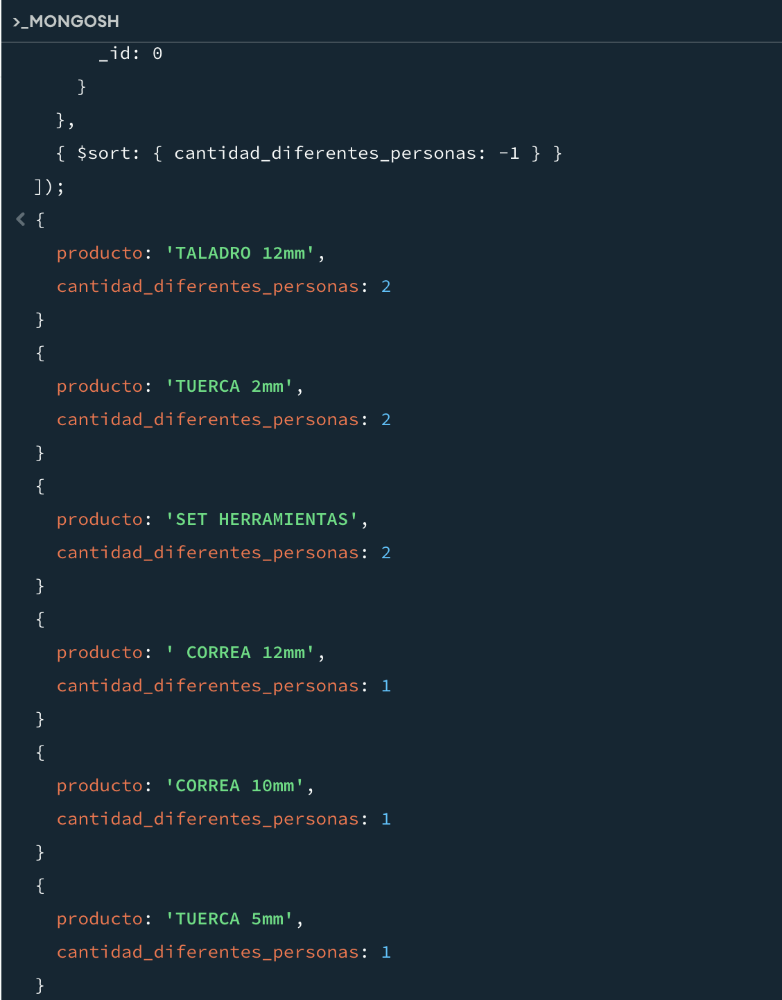

# Trabajo Práctico Nº 2
Referido NoSQL. Mongo DB.

# Base de datos 
Ver [facturas.json](facturas.json) con la estructura y datos. Basicamente es un clásico y simple ejemplo de facturación.

# Resolución
A continuación se mostrará la resolución para cada consulta solicitada.


### 1. Realizar una consulta que devuelva la siguiente información: Región y cantidad total de productos vendidos a clientes de esa Región.
```
db.facturas.aggregate([
  { $unwind: "$item" },
  { $group: { _id: "$cliente.region", total_productos_vendidos: { $sum: "$item.cantidad" } } },
  { $project: { region: "$_id", total_productos_vendidos: 1, _id: 0 } }
]);
```


### 2. Basado en la consulta del punto 1, mostrar sólo la región que tenga el menor ingreso.

Como menor ingreso interpreté que es el pxq. Es decir no los productos vendidos solamente sino también teniendo en cuenta el precio.

```
db.facturas.aggregate([
  { $unwind: "$item" },
  { $group: { _id: "$cliente.region", total_ingreso: { $sum: { $multiply: ["$item.cantidad", "$item.precio"] } } } },
  { $sort: { total_ingreso: 1 } },
  { $limit: 1 },
  { $project: { region: "$_id", total_ingreso: 1, _id: 0 } }
]);
```


### 3. Basado en la consulta del punto 1, mostrar sólo las regiones que tengan una cantidad de productos vendidos superior a 10000.
Dado que no hay tantos productos, la query en realidad será mayor que 400.


### 4. Se requiere obtener un reporte que contenga la siguiente información, nro. cuit, apellido y nombre y región y cantidad de facturas, ordenado por apellido.
```
db.facturas.aggregate([
  { $group: { 
      _id: { cuit: "$cliente.cuit", apellido: "$cliente.apellido", nombre: "$cliente.nombre", region: "$cliente.region" },
      cantidad_facturas: { $sum: 1 }
    } 
  },
  { $project: { 
      cuit: "$_id.cuit", 
      apellido: "$_id.apellido", 
      nombre: "$_id.nombre", 
      region: "$_id.region", 
      cantidad_facturas: 1, 
      _id: 0 
    } 
  },
  { $sort: { apellido: 1 } }
]);
```


### 5. Basados en la consulta del punto 4 informar sólo los le clientes con número de CUIT mayor a 27000000000.
A fines de que devuelva valores le quité un cero, ya que todos los del dataset son más chico, estimo yo que por un error, como si faltara el dígito verificador.
```
db.facturas.aggregate([
  { $group: { 
      _id: { cuit: "$cliente.cuit", apellido: "$cliente.apellido", nombre: "$cliente.nombre", region: "$cliente.region" },
      cantidad_facturas: { $sum: 1 }
    } 
  },
  { $match: { "_id.cuit": { $gt: 2700000000 } } },
  { $project: { 
      cuit: "$_id.cuit", 
      apellido: "$_id.apellido", 
      nombre: "$_id.nombre", 
      region: "$_id.region", 
      cantidad_facturas: 1, 
      _id: 0 
    } 
  },
  { $sort: { apellido: 1 } }
]);
```


### 6. Basados en la consulta del punto 5 informar solamente la cantidad de clientes que cumplen con esta condición.
Similar al anterior, le tuve que quitar un cero. El resultado es consitente con el punto anterior.
```
db.facturas.aggregate([
  { $group: { 
      _id: { cuit: "$cliente.cuit", apellido: "$cliente.apellido", nombre: "$cliente.nombre", region: "$cliente.region" },
      cantidad_facturas: { $sum: 1 }
    } 
  },
  { $match: { "_id.cuit": { $gt: 2700000000 } } },
  { $group: { _id: null, cantidad_clientes: { $sum: 1 } } },
  { $project: { _id: 0, cantidad_clientes: 1 } }
]);
```


### 7. Se requiere realizar una consulta que devuelva la siguiente información: producto y cantidad de facturas en las que lo compraron, ordenado por cantidad de facturas descendente.
```
db.facturas.aggregate([
  { $unwind: "$item" },
  { $group: { _id: "$item.producto", cantidad_facturas: { $sum: 1 } } },
  { $sort: { cantidad_facturas: -1 } },
  { $project: { producto: "$_id", cantidad_facturas: 1, _id: 0 } }
]);
```


### 8. Obtener la cantidad total comprada así como también los ingresos totales para cada producto.
```
db.facturas.aggregate([
  { $unwind: "$item" },
  { 
    $group: { 
      _id: "$item.producto", 
      cantidad_total_comprada: { $sum: "$item.cantidad" },
      ingresos_totales: { $sum: { $multiply: ["$item.cantidad", "$item.precio"] } }
    } 
  },
  { 
    $project: { 
      producto: "$_id", 
      cantidad_total_comprada: 1, 
      ingresos_totales: 1, 
      _id: 0 
    } 
  }
]);
```


### 9. Idem el punto anterior, ordenar por ingresos en forma ascendente, saltear el 1ro y mostrar 2do y 3ro.
```
db.facturas.aggregate([
  { $unwind: "$item" },
  { 
    $group: { 
      _id: "$item.producto", 
      cantidad_total_comprada: { $sum: "$item.cantidad" },
      ingresos_totales: { $sum: { $multiply: ["$item.cantidad", "$item.precio"] } }
    } 
  },
  { $sort: { ingresos_totales: 1 } },
  { $skip: 1 },
  { $limit: 2 },
  { 
    $project: { 
      producto: "$_id", 
      cantidad_total_comprada: 1, 
      ingresos_totales: 1, 
      _id: 0 
    } 
  }
]);
```


### 10. Obtener todos productos junto con un array de las personas que lo compraron. En este array deberá haber solo strings con el nombre completo de la persona. Los documentos entregados como resultado deberán tener la siguiente forma: {producto: “<nombre>”, personas:[“…”, …]}
```
db.facturas.aggregate([
  { $unwind: "$item" },
  { 
    $group: { 
      _id: "$item.producto", 
      personas: { $addToSet: { $concat: ["$cliente.nombre", " ", "$cliente.apellido"] } }
    } 
  },
  { 
    $project: { 
      producto: "$_id", 
      personas: 1, 
      _id: 0 
    } 
  }
]);
```


### 11. Obtener los productos ordenados en forma descendente por la cantidad de diferentes personas que los compraron.
```
db.facturas.aggregate([
  { $unwind: "$item" },
  { 
    $group: { 
      _id: "$item.producto", 
      cantidad_diferentes_personas: { $addToSet: "$cliente.cuit" }
    } 
  },
  { 
    $project: { 
      producto: "$_id", 
      cantidad_diferentes_personas: { $size: "$cantidad_diferentes_personas" }, 
      _id: 0 
    } 
  },
  { $sort: { cantidad_diferentes_personas: -1 } }
]);
```


### 12. Obtener el total gastado por persona y mostrar solo los que gastaron más de 3100000. Los documentos devueltos deben tener el nombre completo del cliente y el total gastado: {cliente:”<nombreCompleto>”,total:<num>}
Acá también, tuve que modificar el tope. Puse 10.000 para que devuelva algo.

```
db.facturas.aggregate([
  { $unwind: "$item" },
  { 
    $group: { 
      _id: { nombre: "$cliente.nombre", apellido: "$cliente.apellido" },
      total_gastado: { $sum: { $multiply: ["$item.cantidad", "$item.precio"] } }
    } 
  },
  { $match: { total_gastado: { $gt: 10000 } } },
  { 
    $project: { 
      cliente: { $concat: ["$_id.nombre", " ", "$_id.apellido"] }, 
      total: "$total_gastado", 
      _id: 0 
    } 
  }
]);
```


### 13. Obtener el promedio de gasto por factura por cada región.
```
db.facturas.aggregate([
  { $unwind: "$item" },
  { 
    $group: { 
      _id: "$cliente.region",
      total_gasto_region: { $sum: { $multiply: ["$item.cantidad", "$item.precio"] } },
      total_facturas: { $addToSet: "$nroFactura" }
    } 
  },
  { 
    $project: { 
      region: "$_id", 
      promedio_gasto_por_factura: { $divide: ["$total_gasto_region", { $size: "$total_facturas" }] }, 
      _id: 0 
    } 
  }
]);
```


### 14. Obtener la factura en la que se haya gastado más. En caso de que sean varias obtener la que tenga el número de factura menor.
```
db.facturas.aggregate([
  { $unwind: "$item" },
  { 
    $group: { 
      _id: "$nroFactura", 
      total_gasto: { $sum: { $multiply: ["$item.cantidad", "$item.precio"] } }
    } 
  },
  { $sort: { total_gasto: -1, _id: 1 } },
  { $limit: 1 }
]);
```


### 15. Obtener a los clientes indicando cuánto fue lo que más gastó en una única factura.
```
db.facturas.aggregate([
  { $unwind: "$item" },
  { 
    $group: { 
      _id: { cuit: "$cliente.cuit", nombre: "$cliente.nombre", apellido: "$cliente.apellido" },
      max_gasto_factura: { $max: { $sum: { $multiply: ["$item.cantidad", "$item.precio"] } } }
    } 
  },
  { 
    $project: { 
      cliente: { $concat: ["$_id.nombre", " ", "$_id.apellido"] }, 
      max_gasto_factura: 1, 
      _id: 0 
    } 
  }
]);
```


### 16. Utilizando MapReduce, indicar la cantidad total comprada de cada ítem. Comparar el resultado con el ejercicio 8.
```
// Map function
var mapFunction = function() {
  this.item.forEach(function(product) {
    emit(product.producto, product.cantidad);
  });
};

// Reduce function
var reduceFunction = function(key, values) {
  return Array.sum(values);
};

// Execute MapReduce
db.facturas.mapReduce(
  mapFunction,
  reduceFunction,
  {
    out: { inline: 1 }
  }
);
```


Como se puede observar, desde la consola de MongoDB Compass no puedo obtener el resultado, por lo tanto no puedo comparar.

### 17. Obtener la información de los clientes que hayan gastado 100000 en una orden junto con el número de orden.
Para que me devuelva valores tuve que ajustar el valor del filtro. En este caso puse 268.
```
db.facturas.aggregate([
  { $unwind: "$item" },
  { 
    $group: { 
      _id: { cuit: "$cliente.cuit", nombre: "$cliente.nombre", apellido: "$cliente.apellido", nroFactura: "$nroFactura" },
      total_gasto: { $sum: { $multiply: ["$item.cantidad", "$item.precio"] } }
    } 
  },
  { $match: { total_gasto: 268 } },
  { 
    $project: { 
      cliente: { $concat: ["$_id.nombre", " ", "$_id.apellido"] }, 
      nro_orden: "$_id.nroFactura", 
      total_gasto: 1, 
      _id: 0 
    } 
  }
]);
```


### 18. En base a la localidad de los clientes, obtener el total facturado por localidad.
No existe el campo localidad. Lo hice por región para poder cumplir con el ejercicio.
```
db.facturas.aggregate([
  { $unwind: "$item" },
  { 
    $group: { 
      _id: "$cliente.region", 
      total_facturado: { $sum: { $multiply: ["$item.cantidad", "$item.precio"] } }
    } 
  },
  { 
    $project: { 
      localidad: "$_id", 
      total_facturado: 1, 
      _id: 0 
    } 
  }
]);
```
