# Trabajo Práctico Nº 3 orientados a grafos. Neo4j.

# Base de datos 
Ver [Datos_Ejemplo_Neo_formateado.txt](Datos_Ejemplo_Neo_formateado.txt) con la estructura y datos.

# Resolución
A continuación se mostrará la resolución para cada consulta solicitada en la [consigna](TP 3 Bases de grafos.pdf).

## Problema con mac
Tuve un problema con mac, que me abría el archivo dado con los datos de forma errónea. En la carpeta del tp podrá ver un .py donde corregí el fomato, con ayuda de un LLM.

## Formato de respuesta
A fines de mostrar el resultado más legible y que verdaderamente se pueda interpertar una respuesta, el resultado lo mostré en formato .txt.

Por supuesto que habrá queries, como la primera que no se podrá ver el 100% de los datos, se imprimió para ver que el resultado tiene sentido y pude obtenerlo.

### 1. Obtener los nodos de todas las personas de la red.
```js
MATCH (p:Persona)
RETURN p;
```
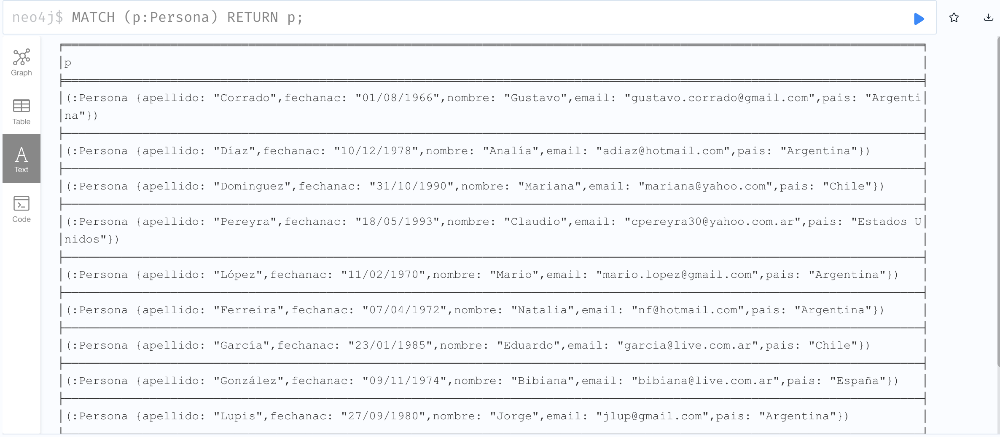


### 2.  Obtener el nombre y fecha de nacimiento de la persona de apellido Domínguez. 
```js
MATCH (p:Persona {apellido: "Dominguez"})
RETURN p.nombre, p.fechanac;
```
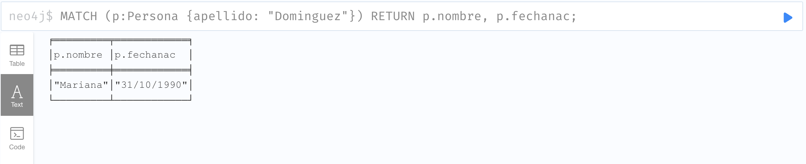


### 3.  Obtener la lista de empresas en las que trabajó Domínguez.
```js
MATCH (p:Persona {apellido: "Dominguez"})-[:TRABAJO]->(e:Empresa)
RETURN e.nombre AS empresa;
```
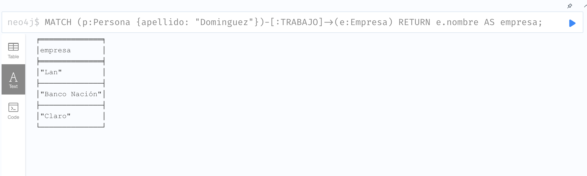

### 4.  Obtener la lista de personas que estudiaron carreras que no son de nivel “Universitario” y los nombres de las carreras. 
```js
MATCH (p:Persona)-[:ESTUDIO]->(c:Carrera)
WHERE c.nivel <> "Universitario"
RETURN p.nombre AS persona, c.nombre AS carrera;
```
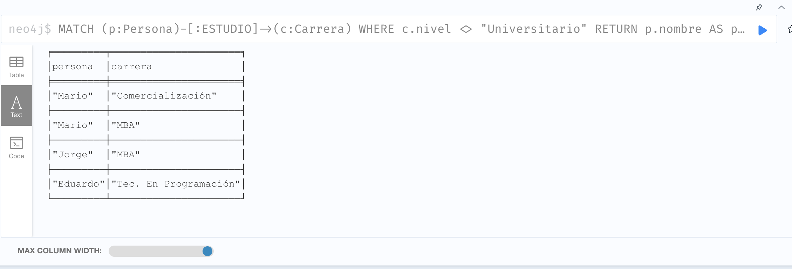

### 5.  Obtener los nodos etiquetados como Conocimiento.
```js
MATCH (c:Conocimiento)
RETURN c;
```
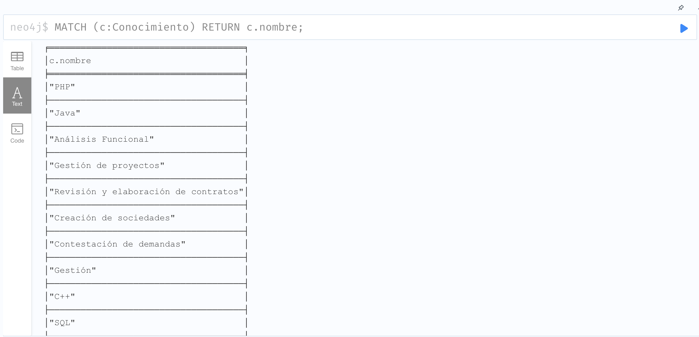

### 6.  Obtener los nodos de todas las personas con nombre terminado en a.
```js
MATCH (p:Persona)
WHERE p.nombre ENDS WITH "a"
RETURN p;
```
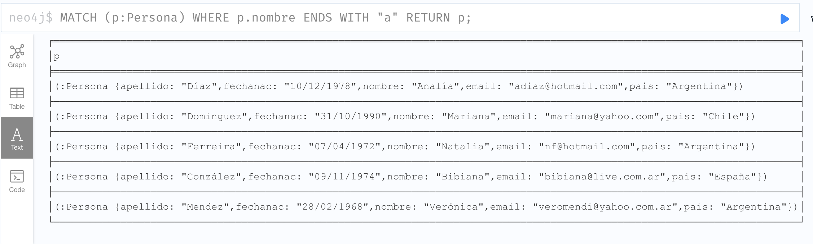

### 7.  Crear un nodo para la persona Analía Martinelli si no existe. 
```js
MERGE (p:Persona {nombre: "Analía", apellido: "Martinelli"})
RETURN p;
```
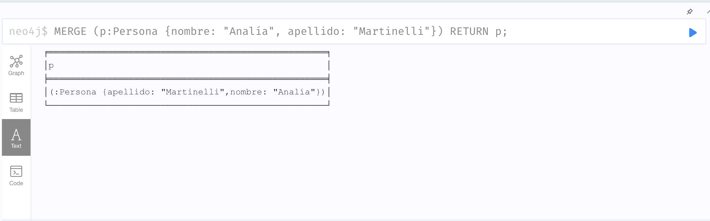

### 8.  Asociar un conocimiento "Cálculo" a Analía Martinelli si no lo posee. 
```js
MERGE (c:Conocimiento {nombre: "Cálculo"})
WITH c
MATCH (p:Persona {nombre: "Analía", apellido: "Martinelli"})
MERGE (p)-[:POSEE]->(c)
RETURN p, c;
```
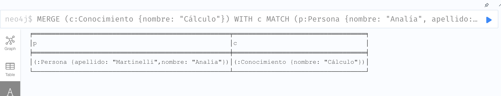

### 9.  Verificar si se creó duplicado del conocimiento "Cálculo".
```js
 MATCH (c:Conocimiento {nombre: "Cálculo"})
RETURN COUNT(c) AS total;
```
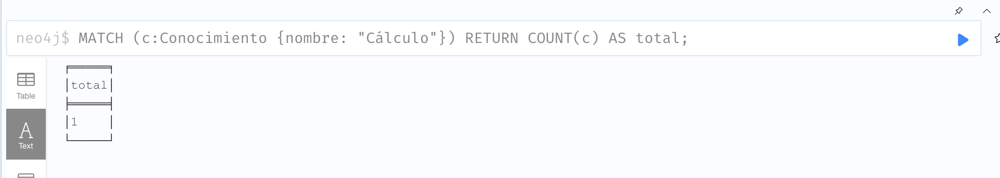


### 10.  Crear una relación ESTUDIO para Analía Martinelli con la carrera "Lic en Sist de Inf", estado "En curso". 
```js
MERGE (c:Conocimiento {nombre: "Cálculo"})
WITH c
MATCH (p:Persona {nombre: "Analía", apellido: "Martinelli"})
MERGE (p)-[:POSEE]->(c)
RETURN p, c;
```
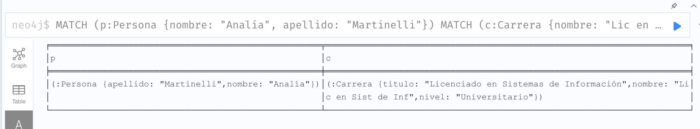

### 11. Crear un nodo para Verónica Mendez
```js
CREATE (p:Persona {nombre: "Verónica", apellido: "Mendez"})
RETURN p;
```
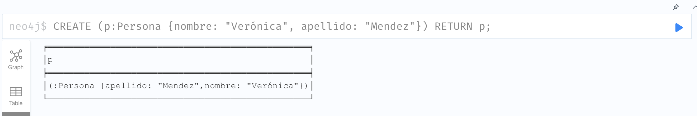

### 12. Crear una relación CONOCE_A entre Analía y Verónica, asegurando que solo se cree una vez.
```js
MATCH (a:Persona {nombre: "Analía", apellido: "Martinelli"})
MATCH (v:Persona {nombre: "Verónica", apellido: "Mendez"})
MERGE (a)-[:CONOCE_A]->(v)
RETURN a, v;
```
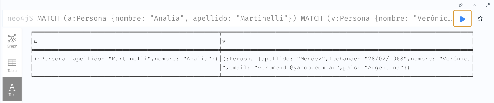

### 13. Actualizar o crear el nodo de Analía Martinelli con fecha de nacimiento 30/06/1968.
```js
MATCH (a:Persona {nombre: "Analía", apellido: "Martinelli"})
MATCH (v:Persona {nombre: "Verónica", apellido: "Mendez"})
MERGE (a)-[:CONOCE_A]->(v)
RETURN a, v;
```
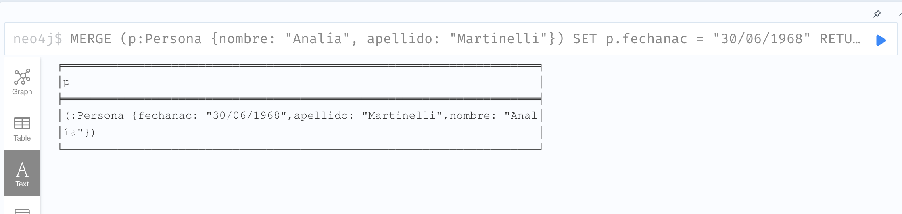

### 14. Agregarle la etiqueta "Empleado" y el país Argentina a Analía.
```js
MATCH (a:Persona {nombre: "Analía", apellido: "Martinelli"})
MATCH (v:Persona {nombre: "Verónica", apellido: "Mendez"})
MERGE (a)-[:CONOCE_A]->(v)
RETURN a, v;
```
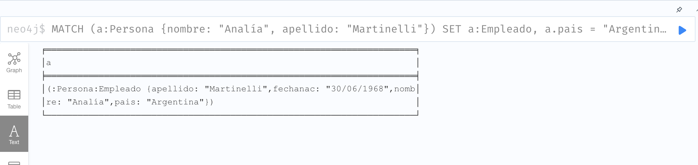

### 15. Eliminar la fecha de nacimiento y la etiqueta Persona de Analía.
```js
MATCH (a:Persona {nombre: "Analía", apellido: "Martinelli"})
REMOVE a:Persona
REMOVE a.fechanac
RETURN a;
```
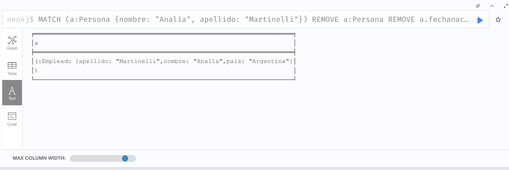

### 16. Eliminar el nodo de Analía y todas sus relaciones
No devuelve nada porque ya borré a la sPersona.
```js
MATCH (a:Persona {nombre: "Analía", apellido: "Martinelli"})
DETACH DELETE a;
```
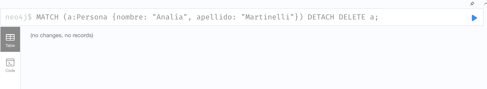

### 17. Contar los nodos en total. 
```js
MATCH (n)
RETURN COUNT(n) AS totalNodos;
```
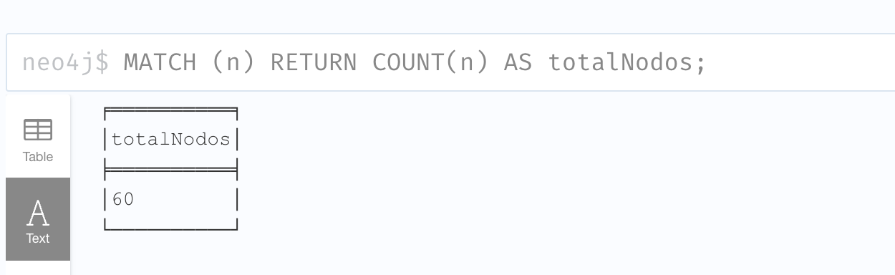

### 18. Contar los tipos de relaciones.
Yo interpreté acá que cuenta por cada tipo de relación la cantidad de relaciones.
```js
MATCH ()-[r]->()
RETURN TYPE(r) AS tipoRelacion, COUNT(r) AS totalRelaciones
ORDER BY totalRelaciones DESC;
```
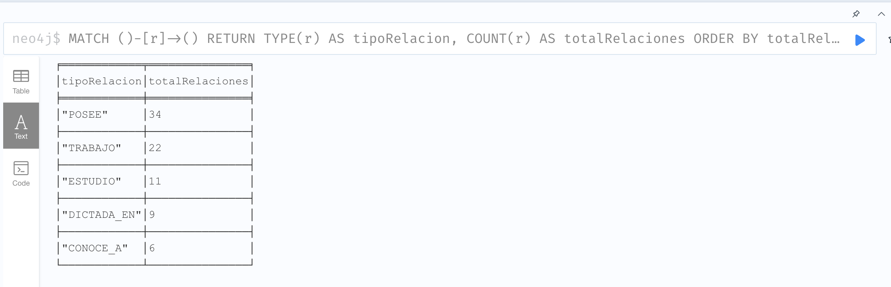

### 19. Listar todos los nodos y sus relaciones
```js
MATCH (n)
OPTIONAL MATCH (n)-[r]->(m)
RETURN n, TYPE(r) AS relacion, m;
```
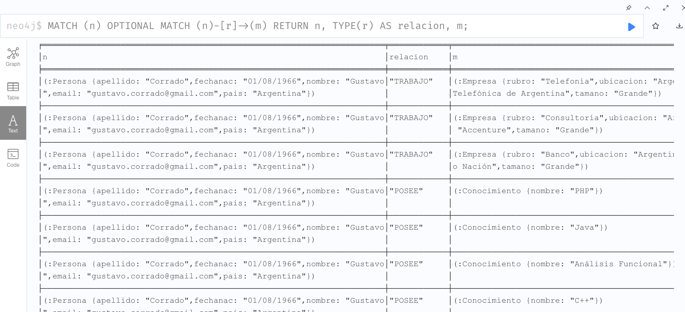


### 20. Obtener los nombres y rubros de las empresas registradas, reemplazando el rubro "Telefonía" por IT
```js
MATCH (e:Empresa)
RETURN e.nombre AS nombre, 
       CASE 
           WHEN e.rubro = "Telefonía" THEN "IT" 
           ELSE e.rubro 
       END AS rubro;
```
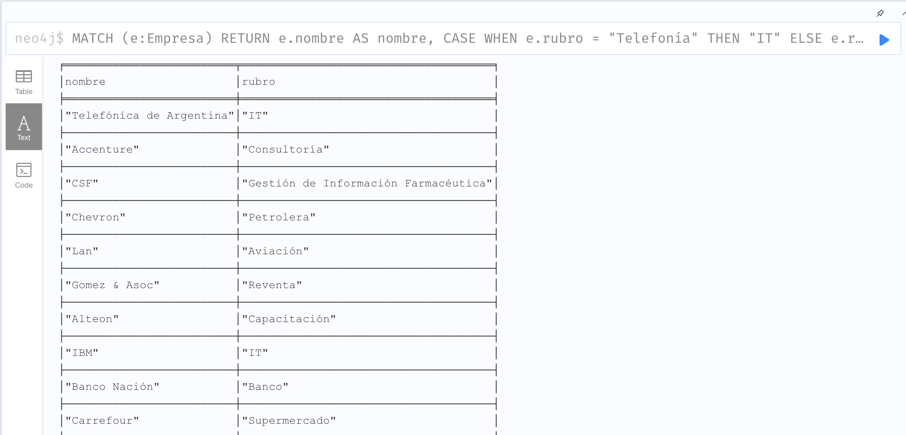

### 21. Determinar qué etiquetas tienen los nodos que son destino de la relación ESTUDIO.

Aquí interpreté que se quería devolver nombre, título y nivel, que son las propiedades. Si yo buscaba labels, me traía solamente "Carrera", por eso modifiqué la query para que traiga los atributos mencionados.
```js
MATCH ()-[:ESTUDIO]->(n)
RETURN labels(n) AS etiquetas
ORDER BY etiquetas DESC;
```

Query modificada:
```js
MATCH ()-[:ESTUDIO]->(n)
RETURN DISTINCT keys(n) AS propiedades;
```
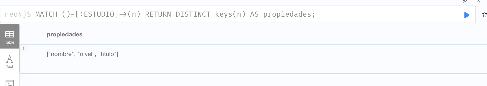

### 22. Verificar las etiquetas de la carrera en la relación ESTUDIO
Para mí es lo mismo que la anterior, entonces en este caso si muestro los labels y verificamos que es Carrera solamente 
```js
MATCH ()-[:ESTUDIO]->(n)
RETURN labels(n) AS etiquetas
ORDER BY etiquetas DESC;
```
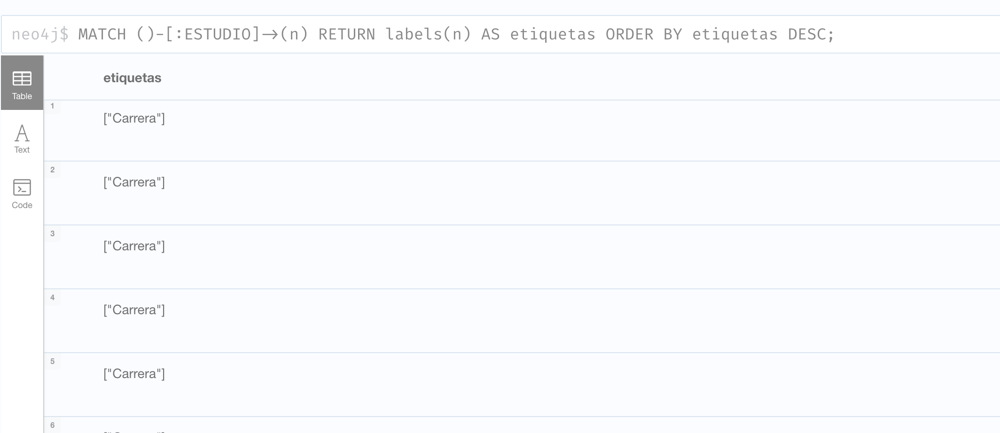

### 23. Usar UNWIND para transformar una colección en filas individuales. 
```js
WITH ["Analía", "Verónica", "Gustavo", "Mariana"] AS nombres
UNWIND nombres AS nombre
RETURN nombre;
```
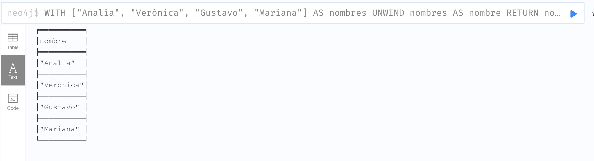

### 24. Contar la cantidad de personas que estudiaron una carrera en cualquier estado. 
 ```js
MATCH (p:Persona)-[:ESTUDIO]->(:Carrera)
RETURN COUNT(DISTINCT p) AS totalPersonas;
```
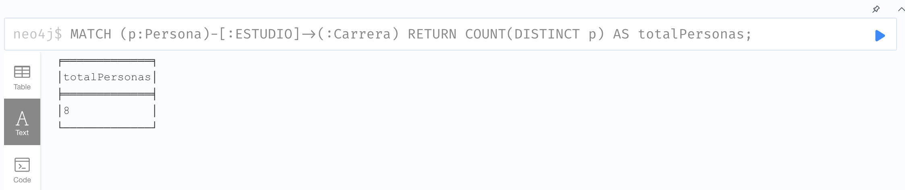

### 25. Identificar si puede llegarse directa o indirectamente desde Mario López hasta Jorge Lupis mediante la relación CONOCE_A. 

 ```js
MATCH (m:Persona {nombre: "Mario", apellido: "López"}), (j:Persona {nombre: "Jorge", apellido: "Lupis"})
MATCH path = (m)-[:CONOCE_A*]->(j)
RETURN path LIMIT 1;
```
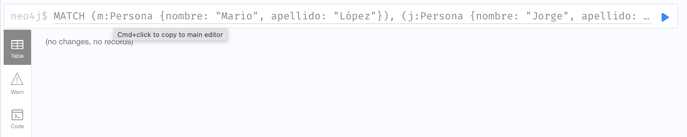

### 26. Obtener el camino más corto entre Gustavo y Mario en la relación CONOCE_A.  
 ```js
MATCH (g:Persona {nombre: "Gustavo"}), (m:Persona {nombre: "Mario"})
MATCH path = shortestPath((g)-[:CONOCE_A*]-(m))
RETURN path;
```
En este caso la imagen es la del path, aquí si se ve de forma interesante los nodos.
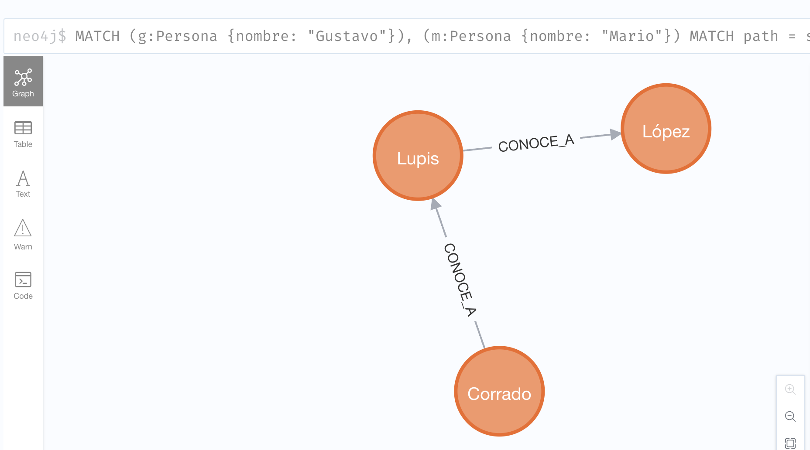


### 27. Listar los caminos de relaciones de un camino determinado.
 ```js
MATCH path = (n1)-[*]->(n2)
WHERE n1.nombre = "Gustavo" AND n2.nombre = "Mario"
RETURN relationships(path) AS relaciones;
```
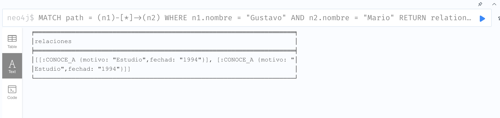

### 28. Verificar si una persona trabajó o trabajó en empresas que otro determinado profesional trabajo, para sugerir contactos. 
 ```js
MATCH (p1:Persona {nombre: "Gustavo"})-[:TRABAJO]->(e:Empresa)<-[:TRABAJO]-(p2:Persona)
WHERE p1 <> p2
RETURN DISTINCT p2.nombre AS posibleContacto, e.nombre AS empresa;
```
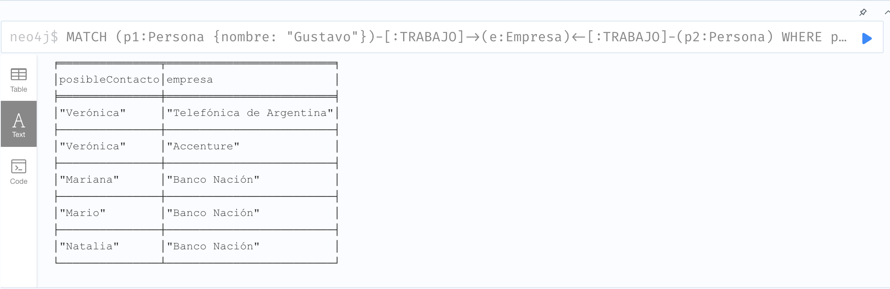

### 29. Obtener los conocimientos más compartidos en cada carrera.
 ```js
MATCH (p:Persona)-[:ESTUDIO]->(c:Carrera), (p)-[:POSEE]->(k:Conocimiento)
WITH c.nombre AS carrera, k.nombre AS conocimiento, COUNT(p) AS total
ORDER BY total DESC
WITH carrera, collect({conocimiento: conocimiento, total: total})[0] AS masCompartido
RETURN carrera, masCompartido.conocimiento AS conocimiento, masCompartido.total AS total;
```
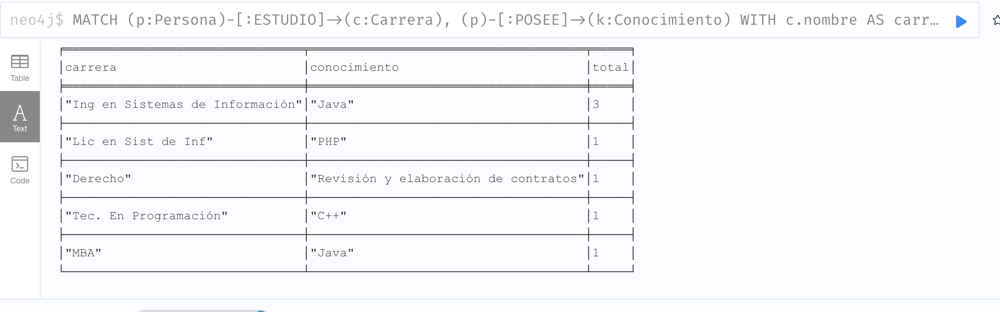

### 30. Ranking de los primeros 2 conocimientos de la carrera "Ing en Sistemas de Información".
 ```js
MATCH (p:Persona)-[:ESTUDIO]->(c:Carrera {nombre: "Ing en Sistemas de Información"}), (p)-[:POSEE]->(k:Conocimiento)
WITH k.nombre AS conocimiento, COUNT(p) AS total
ORDER BY total DESC
RETURN conocimiento, total
LIMIT 2;
```
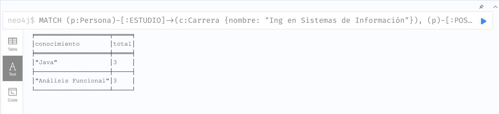