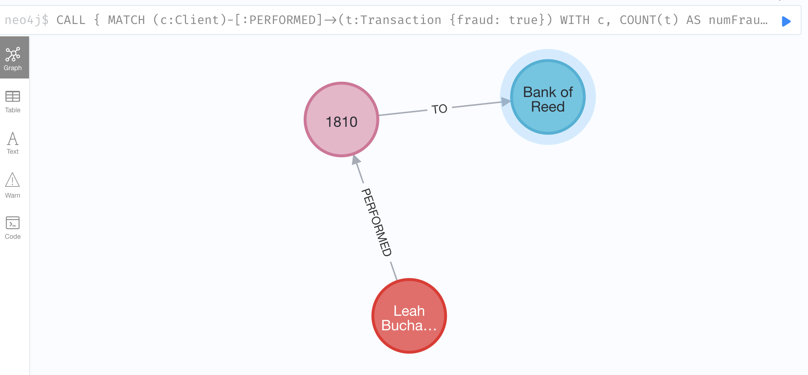

# Trabajo Práctico Final
Finalmente, desarrollé el TP final propuesto por la cátedra. \
Se nos propuso a los alumnos elegir entre los tipos diferentes de base de datos vistos. Yo elegí el orientado a grafos, pues me pareció el más interesado y distinto a lo que yo estaba acostumbrado a ver en mi carrera profesional.

# Consigna
Ver [Grafos.pdf](Grafos.pdf) con la propuesta.

# Prerequisitos y comentarios previos

## PaySim
El detalle completo de la implementación de este simulador de transacciones financieras se puede ver en el [link](https://www.sisu.io/posts/paysim-part2/) descripto en la consulta.

A modo de resumen, la siguiente imagen representa el modelo de datos sobre el que se trabajará:


### Instalación
Se siguieron los pasos para instalar de acuerdo al [repo](https://github.com/voutilad/paysim-demo) suguerido en la página del simulador.

#### Problemas durante la instalación
1. En primer lugar tuve problemas con la versión de JDK de Java. En mi laptop tenía instalada la última versión y el script solo soloporta 8 y 11, al parecer java no es retrocompatible, o por lo menos entre las versiones mencionadas.

2. El script por defecto exige un puerto y password determinado, al principio no había respetado esto entonces no creaba nada en ninguna db.

Finalmente logré que funcione:

Para chequear que se haya importado, realicé una consulta suguerida también en la página del simulador, en donde se muestra la frecuencia y frecuencia relativa de los elementos.

```sql
CALL db.labels() YIELD label
CALL apoc.cypher.run('MATCH (:`'+label+'`) RETURN count(*) as freq',{}) YIELD value
WITH label,value.freq AS freq
CALL apoc.meta.stats() YIELD nodeCount
WITH *, 10^3 AS scaleFactor, toFloat(freq)/toFloat(nodeCount) AS relFreq
RETURN label AS nodeLabel,
    freq AS frequency,
    round(relFreq*scaleFactor)/scaleFactor AS relativeFrequency
ORDER BY freq DESC
```


Nota: He detectado que hay diferencia entre la cantidad de registros que el proceso local me creó respecto a lo que la imagen del sitio se ve. En este caso asumí que no fue un error del proceso sino que se trata de ejemplos que van variando en el tiempo. Puesto que las queries de ejemplo siguen el mismo orden y guardan simulitud, por ejemplo hay muchas mas transacciones que notas de créditos. 

También hice otra query muy sencilla para ver en formato nodo si respetaba el grafo teórico, cosa que sí lo hizo:
```sql
MATCH (n)-[r]->(m)
RETURN n, r, m
LIMIT 100
```


# Resolución
A continuación se mostrará la resolución para cada consulta solicitada en la consigna. Basicamente es realizar ejercicios sobre un simulador de transacciones financieras.

## 1. Mercantes con transacciones fraudulentas por más de un cliente 
Identifica los mercantes que tuvieron transacciones fraudulentas con más de un cliente,ordenados en forma descendente por monto total. 

```sql
MATCH (c:Client)-[:PERFORMED]->(t:Transaction {fraud: true})-[:TO]->(m:Merchant)
WITH m, COUNT(DISTINCT c) AS numClientes, SUM(t.amount) AS totalFraudAmount
WHERE numClientes > 1
RETURN m.id AS MerchantID, numClientes AS FraudulentClients, totalFraudAmount AS TotalFraudAmount
ORDER BY totalFraudAmount DESC
```


## 2. Clientes con información PII compartida 
Encuentra los clientes que comparten información PII (Mail, teléfono o SSN) con más de una persona. Deberás contar cuántas personas comparten información con cada cliente y ordenar de forma descendente. 
```sql

```


## 3. Cliente con mayor actividad fraudulenta 
Identifica al cliente que ha movido más dinero de manera fraudulenta, ordenado por número de transacciones y monto total en forma descendente. 
```sql
MATCH (c:Client)-[:PERFORMED]->(t:Transaction {fraud: true})
WITH c, COUNT(t) AS numFraudulentTransactions, SUM(t.amount) AS totalFraudAmount
RETURN c.id AS ClientID, numFraudulentTransactions AS FraudulentTransactions, totalFraudAmount AS TotalFraudAmount
ORDER BY numFraudulentTransactions DESC, totalFraudAmount DESC
LIMIT 1
```


## 4. Banco con más transacciones 
Determina cuál es el banco que ha tenido el mayor número de transacciones. 
```sql
MATCH (t:Transaction)-[:TO]->(b:Bank)
WITH b, COUNT(t) AS numTransactions
RETURN b.id AS BankID, numTransactions AS TotalTransactions
ORDER BY numTransactions DESC
LIMIT 1
```


## 5. Transferencias fraudulentas a bancos 
Descubre si existen transferencias fraudulentas directas hacia algún banco y cuántas han sido. 
```sql
MATCH (t:Transaction {fraud: true})-[:TO]->(b:Bank)
RETURN b.id AS BankID, COUNT(t) AS FraudulentTransfers
ORDER BY FraudulentTransfers DESC
```


Vemos que no hay transacciones fraudlentas directas hacia bancos.

## 6. Camino más corto entre cliente y banco 
Determina cuál es el camino más corto que relaciona al cliente identificado en el ejercicio 3 con el banco determinado en el ejercicio 4. 
```sql
// Encuentra el cliente con mayor actividad fraudulenta y el banco con más transacciones
CALL {
    MATCH (c:Client)-[:PERFORMED]->(t:Transaction {fraud: true})
    WITH c, COUNT(t) AS numFraudulentTransactions, SUM(t.amount) AS totalFraudAmount
    RETURN c.id AS ClientID
    ORDER BY numFraudulentTransactions DESC, totalFraudAmount DESC
    LIMIT 1
} CALL {
    MATCH (t:Transaction)-[:TO]->(b:Bank)
    WITH b, COUNT(t) AS numTransactions
    RETURN b.id AS BankID
    ORDER BY numTransactions DESC
    LIMIT 1
}
// Encuentra el camino más corto entre el cliente y el banco
MATCH (c:Client {id: ClientID}), (b:Bank {id: BankID})
MATCH p = shortestPath((c)-[*]-(b))
RETURN p
```

 
 Y también visto como grafo:

 

